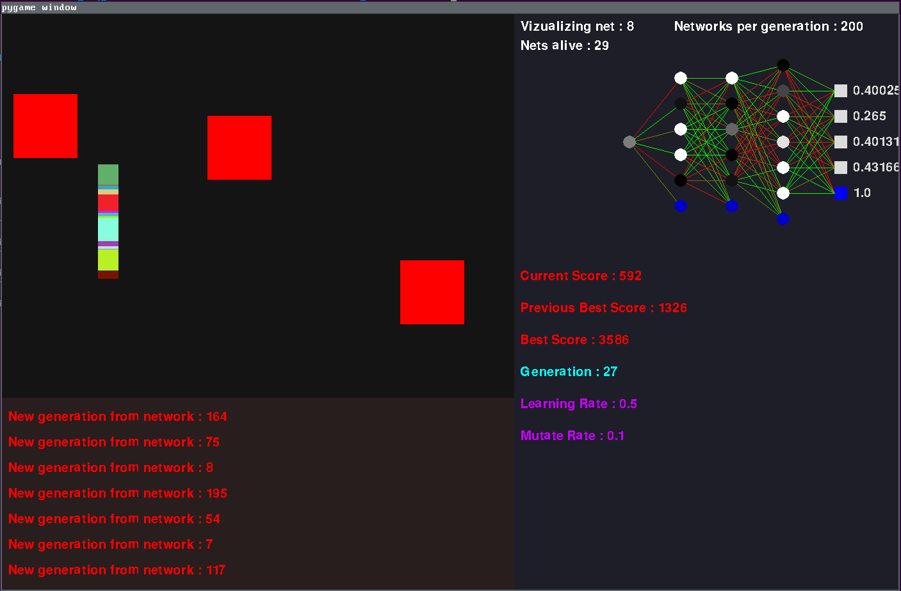

# FlappyML

## Description

This project was about learning how basic neural networks works and starting a neural network library.\
The libraries used in this project were numpy and pygame.\
(this project was done during May 2019 i reuploaded it to github to show it to someone)

## Features

This project was about making:
* a simple game, which would be the environment the AI would evolve in. (cf. top-left part of the picture)
* the start of my own neural network library. (which i was planning on using and growing in future projects but i realized later it was a bit too much work)
* a visualizer of said neural network. (cf. right side of the picture)
* a console for logging informations into. (cf. bottom-left part of the picture)
* a complementary module for genetic evolution of the neural network.

The game is a Flappy-bird-like game, you are the little colored square and you have to avoid hitting the obstacles and the top/bottom border.
A gravity vector is applied to you, meaning you will fall faster and faster, and when you input something, your velocity vector is set to an upward velocity, meaning that you will go up slightly before falling down again because of the gravity vector (nothing special here).\
\
The "cool flashy part" of the project was, of course the network visualizer that you can observe blink while the AI is playing. A dark colored neuron means that he's less activated, while a bright colored neuron means that he's highly activated. The lines connecting the neurons are the weights, a red line means that the weight is negative, and a green one means that the weight is positive.

## Principles

The principle of natural selection was used in this project to make the AI better at the game.\
The program starts by making a bunch of random AI on the first episode, then the AIs play the game.\
Then we take the last survivor AI, copy it and tweak random weights by random values in each of the childs.\
By doing this, the best AI would survive each turn and will eventually reach perfection after a certain amount of run. I achieved to reach perfection on ~90 episodes in average with the best combination of parameters that i found (nb of layers, learning rate, mutation rate etc.)\
\
To avoid "degeneracy", meaning child AI performing worse than the parents because the child "mutated" too much, i started using a "mutation rate" preventing that every weights would mutate in each copy. I enventually found that 0.1 was a good rate for this project, meaning only 10% (in average) of the weights would "mutate" each generation.\
\
Neural Network-wise, there is nothing special about it, its layers basic dense layer.\
The input are, in order (cf. picture from top to bottom):
* The height of the player (the AI)
* The height of the top of the next object.
* The horizontal distance between the player and the next obstacle.
* The height of the bottom of the next object.

The output is the decision of the AI, if output > 0.5 the AI will jump the next frame, otherwise nothing is done.

## Observations

While making this project and watching these AIs struggling on the game i made an observation that wasn't expected at all while making the project.\
I realized that (almost) every single run, the strats thats the AIs "find" are always the same and in the same order.\
Here is basically how every run works:
1. First the AIs quickly die so only the ones that start flying up when their position is too low survives (and those that stop to go up when they're going to reach the ceiling).
2. Then the AIs start to avoid the obstacles by going on the opposite side of the next obstacle, like a mirror.\
Meaning that if the next obstacle is at height 0.7, they'll stick to height 0.3. If next obstacle is at 0.1, they'll stick to height 0.9.\
This lets understand that somewhere, in the network, there's a simple mathematical corellation that built between these neurons and give the first instructions to survive in their environment: go to height: H = 1 - H' (where H is goal height and H' is the height of the next obstacle). This direct observation of the learning process of these little individuals was really cool and unexpected.
3. But this strategy has a major flaw: if the obstacle is at the middle, they'll also go in the middle, inevitably clashing with the obstacle. And that's perfectly logic given the prior statement, if the obstacle is at height 0.5, they would simply go to height 0.5 as well.\
This problem is definitely the longest to overcome in every run and result in the AI being almost perfect.
4. Only some more generations to fix some small parameters and the AI is basically perfect and can run for hours.

This observation was really the coolest thing about this project and made it extra worth it and fascinating.

## Conclusion

I don't have much to say in conclusion beside that this project was a blast to go through, from the very start where i didn't know anything about Machine Learning to the very end.\
This project was by far the most interesting that i had done at this point of my life and i hope this readme was interesting and gave you a little overview of the fascination i've gone through.\
I also hope my english was perfectly intelligible and sorry there some parts poorly written.
